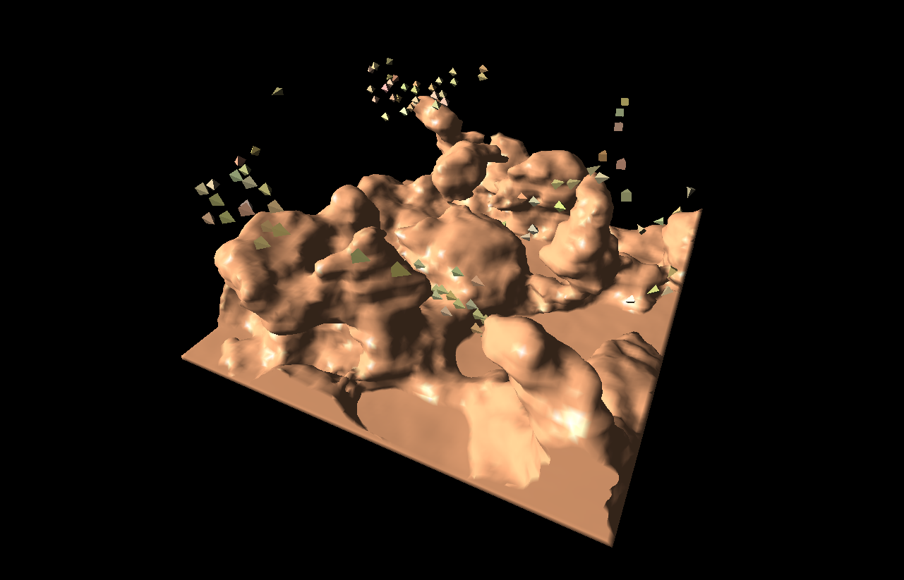
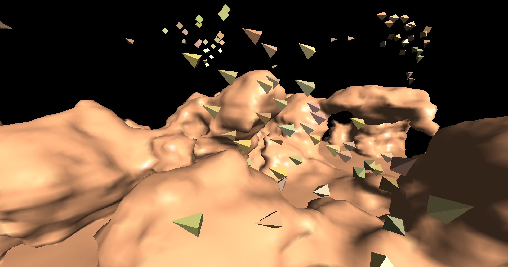

# Boids-and-Marching-Cubes
Boids simulation inside a procedural terrain generated with marching cubes algorithm. The terrain generation and boids are run on the GPU with compute shaders.
It's an improved remake of my [previous](https://github.com/Krafpy/Marching-Cubes) marching cubes attempt that run on CPU.

This project is inspired from Sebastian Lague's videos on [marching cubes](https://www.youtube.com/watch?v=M3iI2l0ltbE) and [boids](https://www.youtube.com/watch?v=bqtqltqcQhw).

## Dependencies
This program uses [GLFW3](https://www.glfw.org/) and [GLEW](http://glew.sourceforge.net/) libraries, and runs on OpengGL 4.6, though it only requires OpenGL 4.3 (don't forget to change the `#version` in shader sources if needed). This project was developed on the CodeBlocks IDE using the 32bit GNU GCC compiler. It should work successfully using a 64bit compiler with the right libraries/DLLs versions, but no garantee. 
Once compiled, the compute shader source files and the `config.txt` file _must_ be in the same location as the executable.

## Features
### Configuration
The configuration file `config.txt` is written in a simple custom markup format. It allows to customize various settings used by the program, even at runtime :
* Terrain noise field generation settings: seed, octaves, lacunarity etc, and more precise features for hard floor and terracing;
* Marching cubes specific settings: grid dimensions, cube size;
* Boids settings: number of boids, view settings, forces coefficients, etc;
* Basic program options;
* Camera settings.

### Controls
* Drag the mouse with `left button` pressed to rotate around the center;
* Drag with `scroll` pressed to translate;
* Scroll to zoom in/out;
* `A`: toggle axes display (`x` in red, `y` in green, `z` in blue);
* `B`: toggle bounding box display;
* `C`: reset camera's center of view;
* `R`: reload configuration settings from the configuration file and apply the changes;
* `D`: toggle mesh display and collision detection with it;
* `P`: pause (boids);
* `space`: generate a new terrain and new boids.

### Terrain
The marching cubes algorithm is implemented with the ability to share vertices between triangles to reduce the memory cost. A smooth rendering is added by calculating interpolated normals for each vertices, used then for the default Gouraud shading performed by the GPU. A CPU floodfill is also performed on the density field to remove regions with a number of points less than `minRegionSize`. This avoids generating random small floating shapes.

### Boids
The boids follow the rules described by Craig Reynolds in his [original paper](https://www.cs.toronto.edu/~dt/siggraph97-course/cwr87/) : _cohesion_, _alignment_ and _separation_, as well as obstacle avoidance by _steer to avoid_ method. The terrain detection is done by checking for a cube that intersects the surface (configuration different from 0) along a ray, in a distance range of `predicitonLength`. No triangle intersection is performed. The bounding box is also interpreted as an obstacle. Boids colors are simply a mix of the main `boidColor` defined in the configuration, and some random offset scaled by `boidColorDeviation` for each boid.

